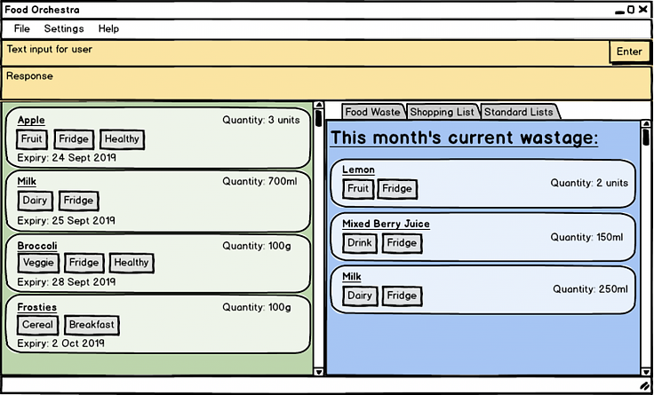

= Address Book (Level 3)
ifdef::env-github,env-browser[:relfileprefix: docs/]

https://travis-ci.org/se-edu/addressbook-level3[image:https://travis-ci.org/se-edu/addressbook-level3.svg?branch=master[Build Status]]
https://ci.appveyor.com/project/damithc/addressbook-level3[image:https://ci.appveyor.com/api/projects/status/3boko2x2vr5cc3w2?svg=true[Build status]]
https://coveralls.io/github/se-edu/addressbook-level3?branch=master[image:https://coveralls.io/repos/github/se-edu/addressbook-level3/badge.svg?branch=master[Coverage Status]]
https://www.codacy.com/app/damith/addressbook-level3?utm_source=github.com&utm_medium=referral&utm_content=se-edu/addressbook-level3&utm_campaign=Badge_Grade[image:https://api.codacy.com/project/badge/Grade/fc0b7775cf7f4fdeaf08776f3d8e364a]
https://gitter.im/se-edu/Lobby[image:https://badges.gitter.im/se-edu/Lobby.svg[Gitter chat]]

ifdef::env-github[]

endif::[]

ifndef::env-github[]
image::images/Ui.png[width="600"]
endif::[]

* If you want to manage your food items without hassle, iFridge is the application made for you!
* This application is made for tech savvy individuals to manage the food in their fridge, control Wastage, and create Shopping Lists.
* This is a desktop application for managing Food in a Fridge. It has a GUI but most of the user interactions happen using a Command Line Interface.
* With reminders for food expiring soon and periodic feedback about the waste generated, iFridge will make sure you review and minimize waste.
* You can create template lists (list of items that you would like to have in your fridge at any time).
* And, with a single command, you can generate a shopping list of items that are in your template list but not yet there in the Fridge!

== Site Map

* <<UserGuide#, User Guide>>
* <<DeveloperGuide#, Developer Guide>>
* <<AboutUs#, About Us>>
* <<ContactUs#, Contact Us>>

== Acknowledgements

* Some parts of this sample application were inspired by the excellent http://code.makery.ch/library/javafx-8-tutorial/[Java FX tutorial] by
_Marco Jakob_.
* Libraries used: https://openjfx.io/[JavaFX], https://github.com/FasterXML/jackson[Jackson], https://github.com/junit-team/junit5[JUnit5]

== Licence : link:LICENSE[MIT]
